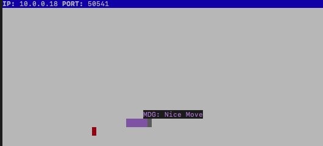

# Snake Client Project

Snake game is a very popular video game. It is a video game concept where the player maneuvers a dot and grows it by ‘eating’ pieces of food. As it moves and eats, it grows and the growing snake becomes an obstacle to smooth maneuvers. The goal is to grow it to become as big as possible without bumping into the side walls, or bumping into itself, upon which it dies.

This is simply a multiplayer take on the genre.

Before you can run this client, you will need to be running the server side which you can download and install from [here](https://github.com/lighthouse-labs/snek-multiplayer). 

## Final Product





## Getting Started

- Follow steps inside the snek server repo to run the server side
- Run the development snake client using the `node play.js` command.

## How to play

Move the snake to "eat" the "food" in the screen, the more food the snake eats the bigger it gets.

- Use 'w' to move up
- Use 'a' to move left
- Use 's' to move down
- Use 'd' to move right

## Messages

Client snake has pre determined mesagges to interact with other users, just use one of the following keys to send the message:

- Use 'l' to send: LOL
- Use 'n' to send: Nice Move
- Use 'b' to send: Be right back

## How to end the game

Unfortunatelly every game must come to an end, only use Ctrl + c to exit the program on the client side.

## Snake Server

Snake server is found [here](https://github.com/lighthouse-labs/snek-multiplayer)

## Adding Broadcasting Messages in  Server

To add messages from the server to clients every time a new client enters the server and the current number of users please add the following line to the server code on ./snek-multiplayer/Remoteinterface.js on line 61:

```javascript
for (const user of this.clients) {
      user.write('New user has joined\n')
      user.write(`Number of players: ${this.clients.length}`)
    }
```


